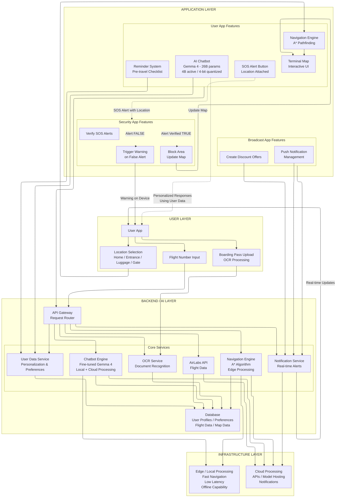

# SkyBuddy — AI Airport Companion

> **No cloud. No account. No waiting. Just your airport, in your pocket.**

SkyBuddy is an offline-first, AI-powered airport companion ecosystem built for the **Airport Companion Hackathon**. It runs Google's **Gemma 4 model entirely on-device** — finetuned by the team, quantized to 4-bit using Google Turbo Quant (26B total params, 4B active). Zero passenger data ever leaves the device.

---

## The Three Apps

### 1. SkyBuddy — Passenger App
The core experience. The user enters a flight number or scans their boarding pass. The app fetches real flight data via AirLabs API, then asks **"Where are you?"** — Home, Entrance, Luggage Point, Security, or Gate.

- **At Home** → Chatbot helps set reminders and generates a pre-flight checklist
- **At Airport** → Live offline terminal map with A\* shortest-path routing and a real-time Blue Dot (powered by step detector + gyroscope sensor fusion)
- **Throughout** → A finetuned Gemma 4 chatbot answers navigation, food, shopping, and flight queries personalised to the user's seat, flight, and current phase

### 2. SkyBeacon — Broadcast & Revenue App
Shop owners at the airport configure their deals in this app. It broadcasts them as **BLE payloads**. When a passenger walks within range, the main app intercepts the signal, generates a Gemma-written personalised tip, and fires a push notification — automatically, no button press needed.

> **Revenue model:** The airport charges shop owners a subscription or per-impression fee for access to the SkyBeacon broadcast network.

### 3. SkySeurity — Security Dashboard
Passengers can tap an **SOS button** on the terminal map if they spot suspicious activity. The alert — with map coordinates and journey state — is instantly pushed to the security officer's dashboard. Officers can:
- **Block the zone** — appears on all passenger maps, A\* reroutes automatically
- **Dismiss** — plays a sound on the reporting passenger's phone
- **Escalate** — flag for physical response

---

## SkyPulse — Proactive AI Awareness Layer

> Your journey, anticipated.

SkyPulse is a proactive intelligence layer built into the map screen. Where the rest of SkyBuddy responds to what you ask, SkyPulse acts before you need to ask — surfacing the right information at exactly the right moment based on 10+ real-time signals.

It lives as a single tap-to-expand capsule on the map UI:

- **Compact view** — always-visible one-liner with your next step and ETA
- **Expanded view** — AI-generated contextual insight with typewriter reveal
- **Auto-collapses** after 10 seconds, getting out of your way

**What triggers SkyPulse:**

| Trigger | Example output |
|---|---|
| Boarding countdown | "Your flight boards in 15 min. Head to Gate C3 now." |
| BLE beacon proximity | "Costa Coffee: 20% off lattes, right next to you." |
| Security checkpoint approach | "Before security: remove laptop, bring passport." |
| Route drift detection | "You might be heading the wrong way." |
| Chat echo | "Your last search: nearest pharmacy is 2 min walk." |
| Floor change | "Floor 2: Duty Free, Lounges, and your gate." |
| Phase transition | Context update when journey state advances. |
| Navigation start | Immediate next-step summary on route begin. |
| Ambient refresh | Periodic low-priority context update. |
| Beacon insight | Security or operational alerts from the BLE mesh. |

**Technical implementation:**
- Event-driven architecture — zero polling, every insight is triggered by a real signal
- Separate LLM prompt path — proactive tips never pollute the chat history
- On-device Gemma inference for all tip generation on a dedicated CPU thread
- BLE beacon mesh feeds directly into the SkyPulse trigger pipeline
- Works alongside the SOS system — security beacon alerts surface through SkyPulse on the map

---

## Architecture



**Module structure:**

```
Multi-Module Android (MVI + Clean Architecture)
├── :app          — Passenger app (Jetpack Compose)
├── :shared       — Common A* pathfinding, indoor location, map models
├── :skybeacon    — BLE broadcaster for shop deals
└── :skysecurity  — Security SOS monitoring dashboard
```

**Key layers inside `:app`:**
- `ai/` — LiteRtLlmEngine (Gemma 4), SkyBuddyToolSet, knowledge base fuzzy search
- `domain/` — IngestFlightUseCase, ChatTurnUseCase (hidden spatial injection), SOS, Beacon, Luggage, Receipt use cases
- `location/` — LocationTrackerService (PDR + BLE scanner foreground service)
- `vision/` — ML Kit BarcodeScanner (PDF417/Aztec), TextRecognizer, ImageLabeler
- `data/` — Room DB: FlightEntity, LuggageEntity, ReceiptEntity, MapNodeEntity, TimelineEventEntity
- `work/` — FlightSyncWorker (WorkManager), FlightAlarmReceiver (AlarmManager)

**Assets:**
- `bangalore_airport_kb.json` — Airport knowledge base for RAG
- `map_layout.json` — Terminal floor plan (offline SVG path data)

---

## Key Features

| Feature | How it works |
|---|---|
| **Boarding pass scan** | ML Kit reads PDF417 barcode → Gemma formats to JSON → auto-alarm T-6hrs before flight |
| **Offline indoor map** | Compose Canvas renders `map_layout.json` with pinch-zoom, A\* routing, NavigationBanner |
| **Live Blue Dot** | Pedestrian Dead Reckoning: step detector + gyroscope fusion, dual-mode drift calibration |
| **JIT BLE deals** | SkyBeacon broadcasts → app intercepts → Gemma tip → push notification, all automatic |
| **SOS system** | Passenger taps SOS → security gets alert → block zone or dismiss |
| **Luggage AI** | Photo at baggage drop → Gemma describes the bag → saved to timeline permanently |
| **Receipt scanner** | ML Kit OCR → Gemma parses merchant, amount, date → ReceiptCard in ledger |
| **Voice I/O** | SpeechRecognizer input + TTS output, offline model support |
| **Unified timeline** | Every event (nav, luggage, receipts, BLE deals, SOS) in one chronological feed |

---

## The AI Model

- **Model:** Google Gemma 4 — finetuned by the team on airport/navigation context
- **Total params:** 26 billion | **Active params (MoE):** 4 billion
- **Quantization:** 4-bit Google Turbo Quant — runs on mid-range Android devices
- **Inference:** Google LiteRT — vision tasks on GPU/NPU, text on CPU (keeps map at 60fps)
- **Personalisation:** User provides seat number and preferences; every LLM response is tailored
- **Spatial injection:** Every prompt secretly includes the user's X/Y map coordinates and journey state

---

## Tech Stack

| Component | Technology |
|---|---|
| UI | Jetpack Compose, Kotlin, MVI |
| AI Engine | Google Gemma 4 via Google LiteRT |
| Computer Vision | ML Kit (BarcodeScanner, TextRecognizer, ImageLabeler) |
| Indoor Positioning | Android SensorManager — PDR (step detector + rotation vector) |
| Map | Custom Compose Canvas + offline A\* pathfinding |
| BLE | BluetoothLeScanner (app) + BluetoothLeAdvertiser (SkyBeacon) |
| Background | WorkManager, AlarmManager, Foreground Service |
| Database | Room DB + Hilt DI |
| Voice | SpeechRecognizer + TextToSpeech |
| Flight Data | AirLabs REST API (HTTPS, Wi-Fi only, PNR string only) |

---

## Security

- All Gemma inference on-device — no prompt or image ever leaves the phone
- Room DB encrypted with SQLCipher (AES-256, Android Keystore-bound key)
- BLE payloads validated with HMAC-SHA256 before reaching the LLM
- Only outbound call: PNR string to AirLabs over HTTPS (certificate pinned)
- `android:usesCleartextTraffic="false"` blocks all HTTP app-wide
- Runtime-only Android 14+ permissions with graceful degradation
- **DPDP Act compliant by architecture** — no accounts, no central data store

---

## vs Adani Airports

Adani's ecosystem (aviio, OneApp, Digi Yatra, IntelliMate/AIONOS) has three critical gaps:

| Gap | Adani | SkyBuddy |
|---|---|---|
| Cloud dependency | All AI requires internet | Gemma runs 100% on-device |
| No indoor positioning | Static map only | Live PDR Blue Dot |
| Menu-driven UX | Transactional tap-to-book | Conversational, context-aware LLM |
| No boarding pass AI | Manual PNR entry | Barcode scan → auto everything |
| Reactive only | User must always ask | JIT BLE tips pushed automatically |
| Privacy risk | PII sent to cloud | Zero bytes of personal data transmitted |

---

## Setup

```bash
# 1. Add to local.properties
AIRLABS_API_KEY=your_key_here
LLM_MODEL_PATH=app/src/main/assets/gemma4_turbo_q4.tflite

# 2. Build all modules
./gradlew :app:assembleDebug
./gradlew :skybeacon:assembleDebug
./gradlew :skysecurity:assembleDebug

# 3. Install on demo devices
adb install app/build/outputs/apk/debug/app-debug.apk
adb install skybeacon/build/outputs/apk/debug/skybeacon-debug.apk
adb install skysecurity/build/outputs/apk/debug/skysecurity-debug.apk
```

**Requirements:** Android Studio Hedgehog+, SDK 34 (target) / SDK 26 (min), Android 12+ device recommended

---

## File Structure

```
SkyBuddy/
├── app/src/main/
│   ├── assets/
│   │   ├── bangalore_airport_kb.json
│   │   └── map_layout.json
│   └── java/com/example/skybuddy/
│       ├── ai/          # LLM engine, toolset, KB search
│       ├── audio/       # TTS, voice controller
│       ├── core/        # Utilities, permissions
│       ├── data/        # Room DB, DAOs
│       ├── domain/      # Use cases
│       ├── location/    # LocationTrackerService
│       ├── ui/          # Compose screens
│       ├── vision/      # ML Kit
│       └── work/        # WorkManager, AlarmManager
├── shared/              # A* pathfinding, IPS, map models
├── skybeacon/           # BLE broadcaster app
├── skysecurity/         # Security dashboard app
└── llm_scripts/         # Python tools for LLM management
```

---

*Built for the Airport Companion AI Hackathon · Gemma 4 On-Device · Offline-First · Privacy-First*
